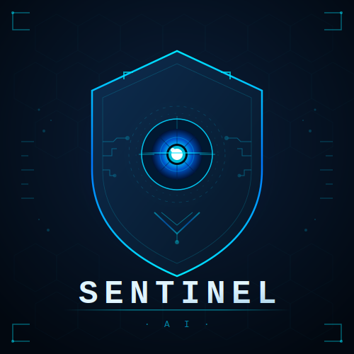

<h1 align="center">Welcome to SentinelAI</h1>

  AI-Powered Surveillance and Incident Detection Platform

  

---

We are a development organization focused on building SentinelAI, an intelligent surveillance platform designed to analyze video feeds and detect suspicious activity using locally hosted AI models.

Our goal is to explore the intersection of artificial intelligence, backend engineering, and real-time monitoring systems, while building a scalable platform that demonstrates modern full-stack system architecture.

Through this project we aim to create a platform where developers can experiment with AI-powered monitoring, video processing pipelines, and intelligent incident detection.

---

Join the project and follow the development of SentinelAI as we build a production-style AI monitoring platform.

---

 Get Involved

We welcome developers who are interested in AI systems, backend engineering, and full-stack development.

Feel free to explore the repositories, open issues, or contribute to the project.

---

 Contact Us

If you have questions, collaboration ideas, or would like to get involved, feel free to reach out.

📧 Email: [sentinelaijjck@gmail.com](mailto:sentinelaijjck@gmail.com)
